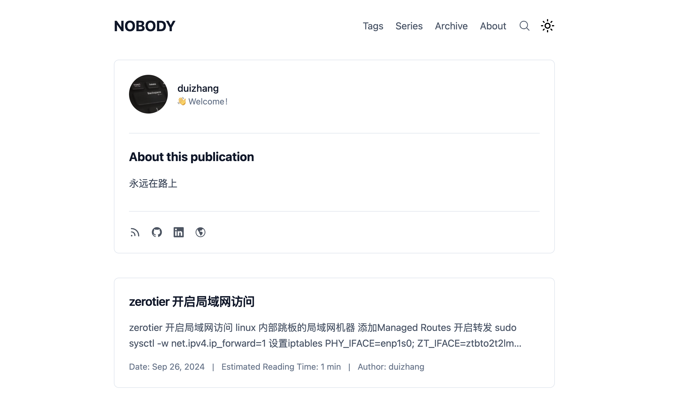
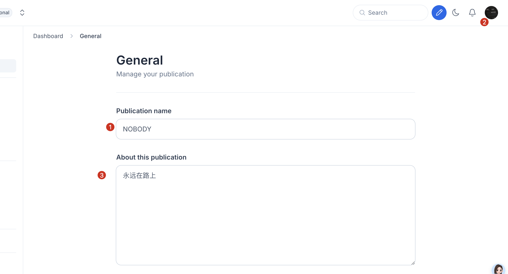
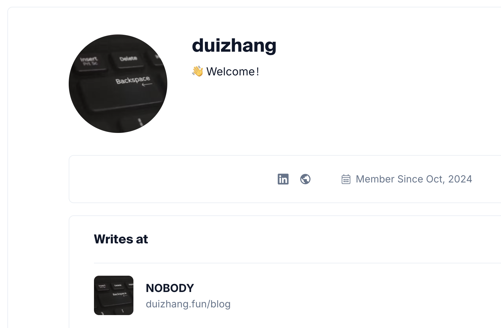
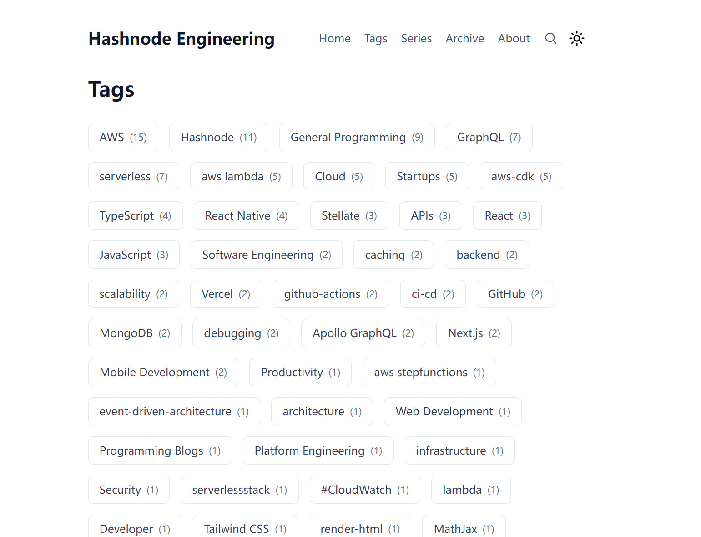
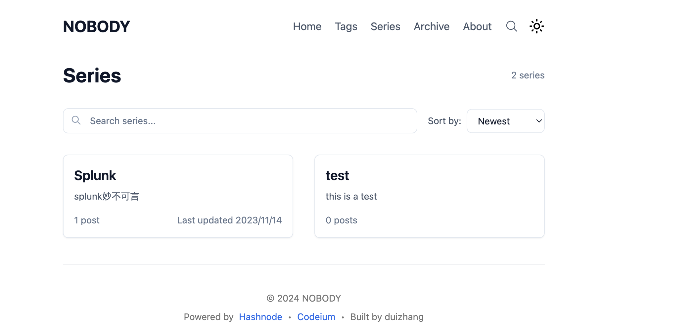
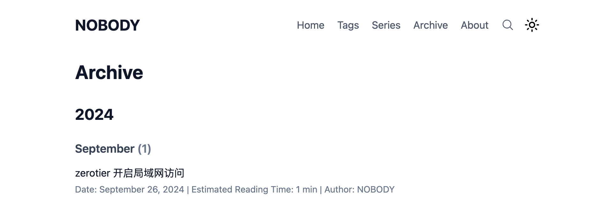
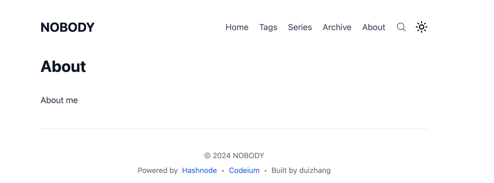
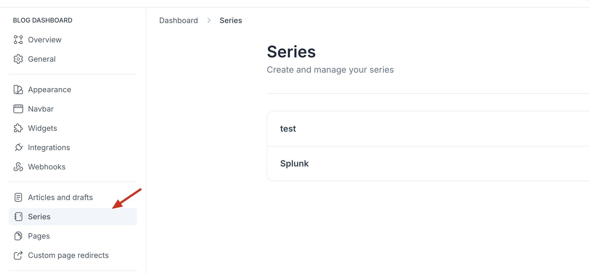
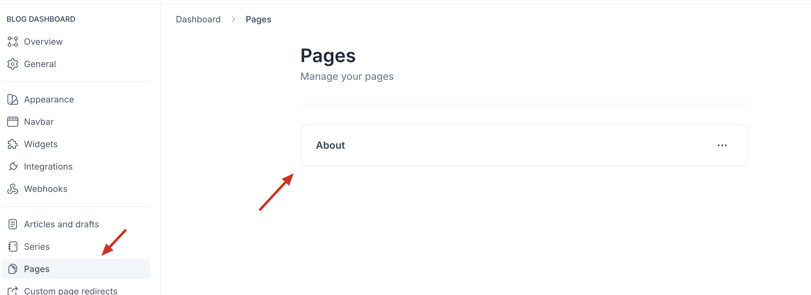
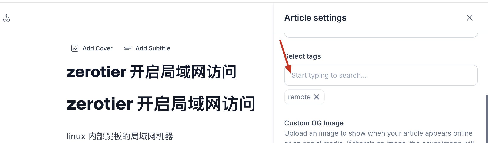

# Personal Blog Starter Kit | 个人博客启动套件

[English](#english) | [中文](#中文)

<p align="center">
  <a href="https://hashnode.com">
    <picture>
      <source media="(prefers-color-scheme: dark)" srcset="https://cdn.hashnode.com/res/hashnode/image/upload/v1611902473383/CDyAuTy75.png?auto=compress">
      
    </picture>
    <h1 align="center">Hashnode Blog</h1>
  </a>
</p>

<p align="center">
  <a href="https://hashnode.com">
    
  </a>
  <a href="https://codeium.com">
    
  </a>
  <a href="https://github.com/duizhang1/blog">
    
  </a>
</p>

<h2 id="english">English</h2>

## 🌟 Features

- 📝 Clean and minimalist blog design
- 🎨 Dark/Light mode support
- 📱 Fully responsive design
- 🔍 Advanced search functionality
- 📂 Article archive by year and month
- 🏷️ Tag system with dedicated pages
- 📄 About page with Markdown support
- 📰 RSS feed support
- 🖼️ OG image generation
- 🔗 Social sharing
- 📊 Built-in analytics
- ⚡ Optimized performance

## 📸 Screenshots

<details>
<summary>Click to view screenshots</summary>

### Home Page




### Content Organization




### Additional Features





</details>

## 🚀 Quick Start

### Deploy to Vercel

1. Fork this repository to your GitHub account
2. Create a new project on [Vercel](https://vercel.com)
3. Import your forked repository
4. Configure environment variables:
   ```
   NEXT_PUBLIC_HASHNODE_GQL_ENDPOINT=https://gql.hashnode.com
   NEXT_PUBLIC_HASHNODE_PUBLICATION_HOST=your-username.hashnode.dev
   NEXT_PUBLIC_BASE_URL=https://your-domain.com
   NEXT_PUBLIC_MODE=production
   ```
5. Deploy!

### Local Development

```bash
# Clone the repository
git clone https://github.com/yourusername/blog.git

# Install dependencies
npm install
# or
yarn install
# or
pnpm install

# Start development server
npm run dev
# or
yarn dev
# or
pnpm dev
```

## 🛠️ Tech Stack

- [Next.js](https://nextjs.org/)
- [TypeScript](https://www.typescriptlang.org/)
- [Tailwind CSS](https://tailwindcss.com/)
- [GraphQL](https://graphql.org/)
- [Hashnode API](https://api.hashnode.com/)

## 📄 License

This project is licensed under the MIT License.

<h2 id="中文">中文</h2>

## 🌟 特性

- 📝 简洁优雅的博客设计
- 🎨 支持深色/浅色模式
- 📱 完全响应式设计
- 🔍 高级搜索功能
- 📂 按年月归档文章
- 🏷️ 标签系统及专属页面
- 📄 支持 Markdown 的关于页面
- 📰 RSS 订阅支持
- 🖼️ OG 图片生成
- 🔗 社交分享功能
- 📊 内置分析功能
- ⚡ 性能优化

## 📸 截图展示

<details>
<summary>点击查看截图</summary>

### 主页


### 内容组织


### 其他功能


</details>

## 🚀 快速开始

### 部署到 Vercel

1. Fork 此仓库
2. 在 [Vercel](https://vercel.com) 创建新项目
3. 导入你的 Fork 仓库
4. 配置环境变量：
   ```env
   NEXT_PUBLIC_HASHNODE_GQL_ENDPOINT=https://gql.hashnode.com
   NEXT_PUBLIC_HASHNODE_PUBLICATION_HOST=your-username.hashnode.dev
   NEXT_PUBLIC_BASE_URL=https://your-domain.com
   NEXT_PUBLIC_MODE=production
   ```
5. 开始部署！

### 本地开发

```bash
# 克隆仓库
git clone https://github.com/yourusername/blog.git

# 安装依赖
pnpm install

# 启动开发服务器
pnpm dev
```

## 🛠️ 技术栈

- [Next.js](https://nextjs.org/) - React 框架
- [TypeScript](https://www.typescriptlang.org/) - 类型安全
- [Tailwind CSS](https://tailwindcss.com/) - 样式框架
- [GraphQL](https://graphql.org/) - API 查询语言
- [Hashnode API](https://api.hashnode.com/) - 博客后端

## 📄 开源协议

本项目采用 MIT 协议开源。
